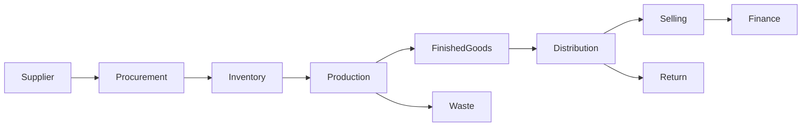
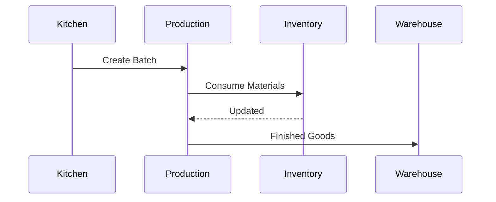
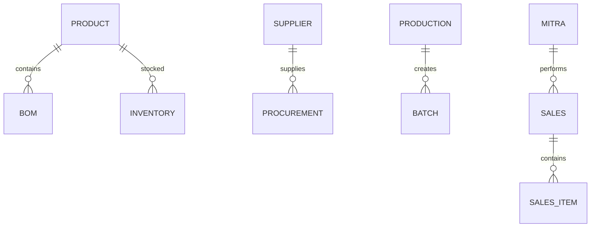

# Mermaid Diagrams

## High Level Flow

```mermaid
flowchart LR
Supplier-->Procurement-->Inventory-->Production-->FinishedGoods-->Distribution-->Selling-->Finance
Production-->Waste
Distribution-->Return
```

## Production Sequence

```mermaid
sequenceDiagram
Kitchen->>Production: Create Batch
Production->>Inventory: Consume Materials
Inventory-->>Production: Updated
Production->>Warehouse: Finished Goods
```

## ERD

```mermaid
erDiagram
PRODUCT ||--o{ BOM : contains
PRODUCT ||--o{ INVENTORY : stocked
SUPPLIER ||--o{ PROCUREMENT : supplies
PRODUCTION ||--o{ BATCH : creates
MITRA ||--o{ SALES : performs
SALES ||--o{ SALES_ITEM : contains
```
